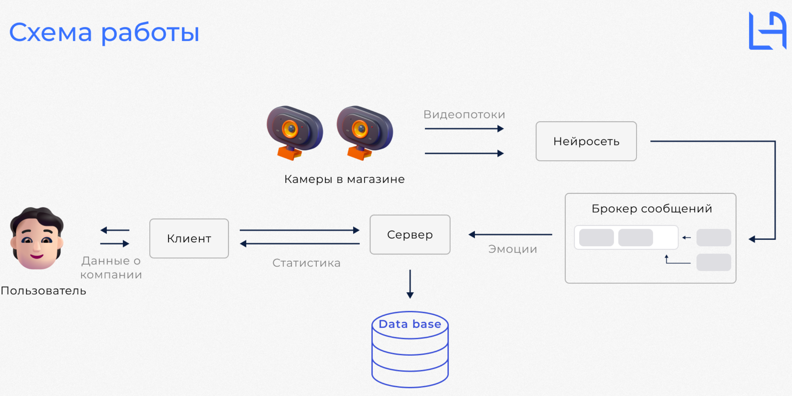

# EDA (emotion decetion app)

### Services:
- [Learning](./learning)
- [Emotion detector:](./inference)
- [Frontend](./client1)
- [Backend](./server)

### Start
- RESTApi server: `run app.py`

Чтобы сразу имитировать rtsp поток вместо использования /dev/video0:
`sudo docker run --device=/dev/video0 --network="host" -it mpromonet/v4l2rtspserver:v0.3.8 -I 127.0.0.1 -P 18554 -u test`       
Чтобы заработала библиотека OpenCV c gstreamer бэкэндом, необходимо руками собрать эту библиотеку:
Для python:         
* `git submodule update --init --recursive --depth 1`     
* `cd opencv-python`      
* `git checkout origin/master`        
* `git submodule update --recursive`      
* `export ENABLE_CONTRIB=1`
На устройстве без видеокарты:
* `export CMAKE_ARGS="-DWITH_GSTREAMER=ON"`   
На устройстве с видеокартой:
* `export CMAKE_ARGS="-DCMAKE_BUILD_TYPE=RELEASE -DCMAKE_INSTALL_PREFIX=/usr/local -DINSTALL_C_EXAMPLES=ON -DINSTALL_PYTHON_EXAMPLES=ON -DWITH_CUDA=ON -DWITH_CUBLAS=1 -DENABLE_FAST_MATH=1 -DCUDA_FAST_MATH=1 -DWITH_CUDNN=ON -DOPENCV_DNN_CUDA=ON -DWITH_GSTREAMER=ON -DWITH_GSTREAMER_0_10=OFF -DBUILD_EXAMPLES=ON"`
* `python3 -m pip wheel . --verbose`      
* `python3 -m pip install opencv_*.whl`    

Чтобы детекция лица заработала на видеокарте необходимо собрать библиотеку dlib под cuda:
cmake .. -DDLIB_USE_CUDA=1 -DUSE_AVX_INSTRUCTIONS=1

### Description

